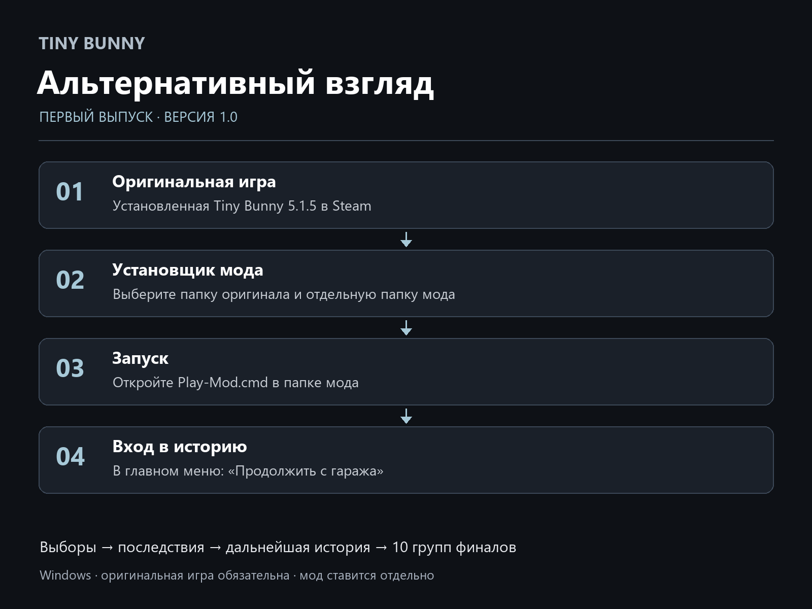

# Установка — версия 1.0

Требуется Windows и установленная оригинальная Tiny Bunny **5.1.5, Steam build 23204378**. Совместимость других сборок не заявляется. Мод бесплатный и не включает оригинальную игру.

## Установщик EXE — рекомендуемый способ

1. Закройте игру.
2. Откройте [выпуск 1.0](https://github.com/LosarOS/TinyBunny-Alternative-View/releases/tag/v1.0.0), раскройте **Assets** и скачайте `TinyBunny-Alternative-View-Setup-1.0.0.exe`.
3. Запустите установщик и выберите папку оригинала — ту, в которой находится `TinyBunny.exe`.
4. В Steam её можно открыть так: библиотека → Tiny Bunny → свойства → установленные файлы → обзор.
5. Выберите **другую, отдельную папку мода**, например `D:\Games\TinyBunny-Alternative-View`. Она не должна совпадать с папкой оригинала или находиться внутри неё.
6. Завершите установку. В выбранной папке мода откройте `Play-Mod.cmd`.
7. В главном меню нажмите **«Продолжить с гаража»**. Это прямой вход в модовую историю.

«Новая игра» начинает оригинальную историю; «Загрузить» открывает сохранения. Установщик не настраивает параметры запуска Steam автоматически.



## Архив ZIP — ручная установка

1. В Assets скачайте `TinyBunny-Alternative-View-1.0.0.zip`. Не выбирайте автоматически созданные GitHub ссылки **Source code** — это только документация репозитория.
2. Распакуйте ZIP в отдельную папку, не поверх оригинальной игры.
3. Запустите `Launch-FINAL.cmd`. Его исходный путь по умолчанию — `D:\Steam\steamapps\common\TinyBunny`.
4. Если игра установлена иначе, откройте PowerShell в папке мода и выполните:

```powershell
.\Launch-FINAL.cmd -Install "C:\Program Files (x86)\Steam\steamapps\common\TinyBunny"
```

В команде укажите свой фактический путь. Далее выберите «Продолжить с гаража».

## Сохранения, обновление и удаление

Сохранения мода находятся в `saves` его папки. Перед удалением/обновлением сделайте резервную копию. Совместимость будущих выпусков будет описана отдельно.

После установки через EXE используйте `Uninstall-Mod.cmd` в папке мода. Пользовательские сохранения и резервные копии сохраняются. Ручной ZIP можно удалить после сохранения нужных saves. Оригинальная игра не перезаписывается.

## Если запуск не удался

- **Не найден TinyBunny.exe:** укажите именно папку оригинала, а не его `game`.
- **Неподдерживаемая версия или несовпадение хэшей:** используется другая/изменённая сборка оригинала. Нужна указанная выше совместимая версия. Не обходите проверку и не отключайте защиту Windows.
- **Нет входа в мод:** убедитесь, что запустили `Play-Mod.cmd` или `Launch-FINAL.cmd` из папки мода, затем выбрали «Продолжить с гаража».
- Для сообщения об ошибке укажите Windows, версию игры, версию мода, свои выборы и приложите скриншот. Пароли, токены и личные файлы прикладывать не нужно.

## Проверка скачанного файла

Выпуск содержит `SHA256SUMS.txt`. Например:

```powershell
Get-FileHash -LiteralPath .\TinyBunny-Alternative-View-Setup-1.0.0.exe -Algorithm SHA256
```

Сравните Hash с соответствующей строкой файла SHA256SUMS.txt.
