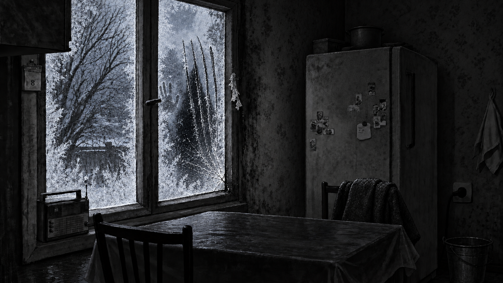
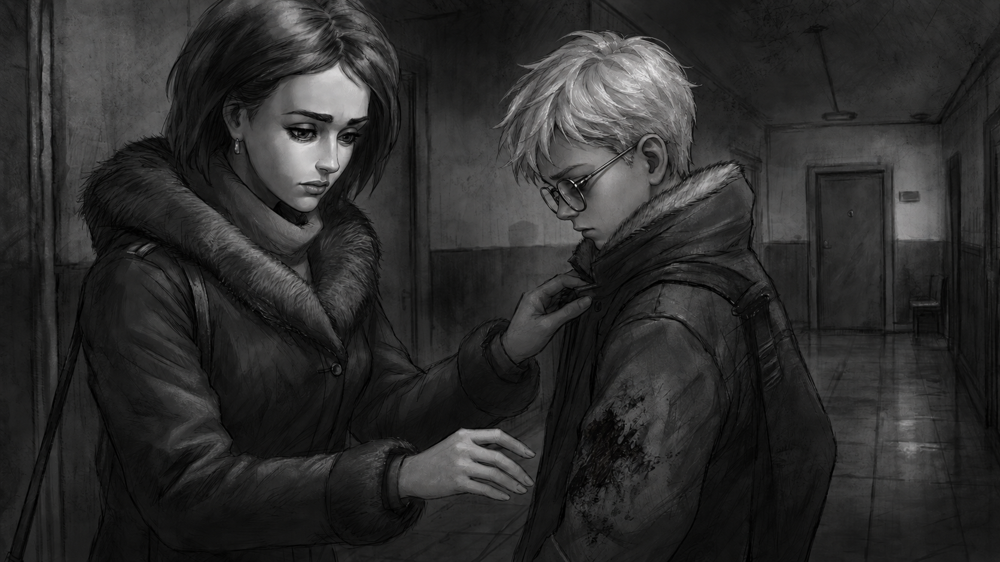

# Tiny Bunny: Альтернативный взгляд

**Первый публичный выпуск — версия 1.0.** Бесплатный неофициальный мод для Tiny Bunny / «Зайчик» на Windows.

[**Скачать установщик и ZIP**](https://github.com/LosarOS/TinyBunny-Alternative-View/releases/tag/v1.0.0) · [Инструкция на русском](INSTALL_RU.md) · [Сообщить об ошибке](https://github.com/LosarOS/TinyBunny-Alternative-View/issues)

## О моде

Альтернативное развитие IV–V эпизодов, которое начинается с гаража и соединяется с оригинальными сценами. Решения влияют на спасение, отношения и дальнейшие события. В моде 10 групп финалов; эпилоги и газетные страницы показывают последствия пережитого.

Добавлены бытовые и поисковые микроистории, осмотры и дальнейшее использование найденных предметов, варианты осады дома, новые художественные кадры, постановка действий и музыкальное сопровождение из локальных ресурсов оригинала.

**Новая озвучка пока не добавлена.** Это первая опубликованная версия; сообщения об ошибках и отзывы помогут следующему выпуску.

Это художественные кадры текущего мода, показанные без раскрытия концовок. Новые иллюстрации созданы с помощью генеративного инструмента и используются в игровых сценах.

## Быстрый старт

1. Нужна установленная **Tiny Bunny 5.1.5, Steam build 23204378**.
2. Скачайте EXE из **Assets** выпуска и выберите папку оригинала и отдельную папку мода.
3. Запустите `Play-Mod.cmd` → **«Продолжить с гаража»**.

ZIP — альтернативный способ установки; для него используется `Launch-FINAL.cmd`. Подробности — в [гайде](INSTALL_RU.md).

## Файлы выпуска

| Файл | Назначение | Размер |
| --- | --- | --- |
| `TinyBunny-Alternative-View-Setup-1.0.0.exe` | Установщик | 221.0 МБ |
| `TinyBunny-Alternative-View-1.0.0.zip` | Ручная установка | 219.1 МБ |
| `SHA256SUMS.txt` | Проверка целостности | текст |

Кнопки GitHub **Source code** скачивают документацию этого публичного репозитория, а не готовый мод. Пользуйтесь файлами EXE/ZIP в Assets.

## Оригинал и авторство

Требуется приобретённая и установленная оригинальная игра. Её executable, архивы и озвучка не распространяются здесь. Музыка, голоса и персонажи оригинала принадлежат его правообладателям и используются из вашей локальной установки.

Это неофициальный некоммерческий проект. [Авторство и ресурсы](CREDITS_RU.md). Данный репозиторий служит для распространения установщика, документации и иллюстраций; исходный проект и внутренние материалы проверки здесь не публикуются.
